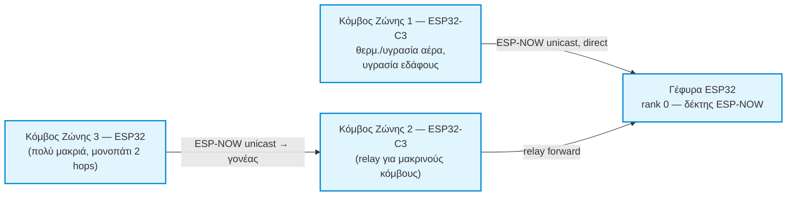
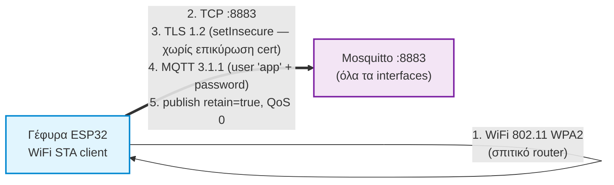
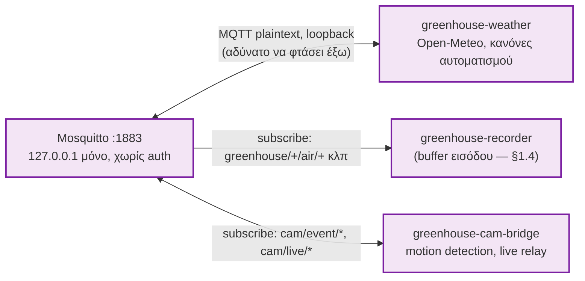
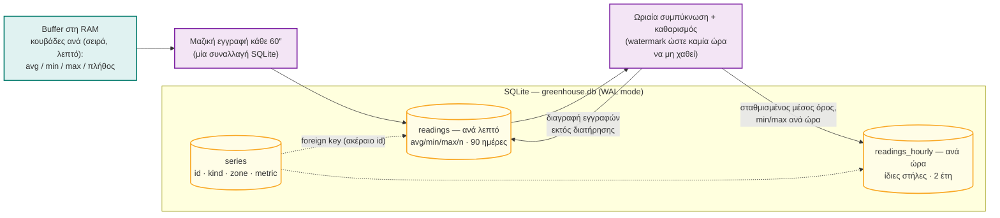
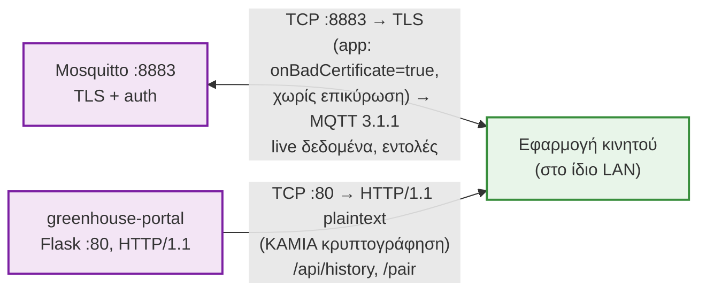
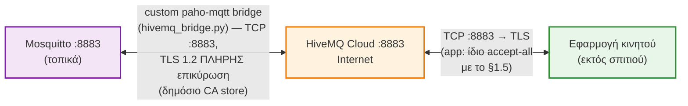
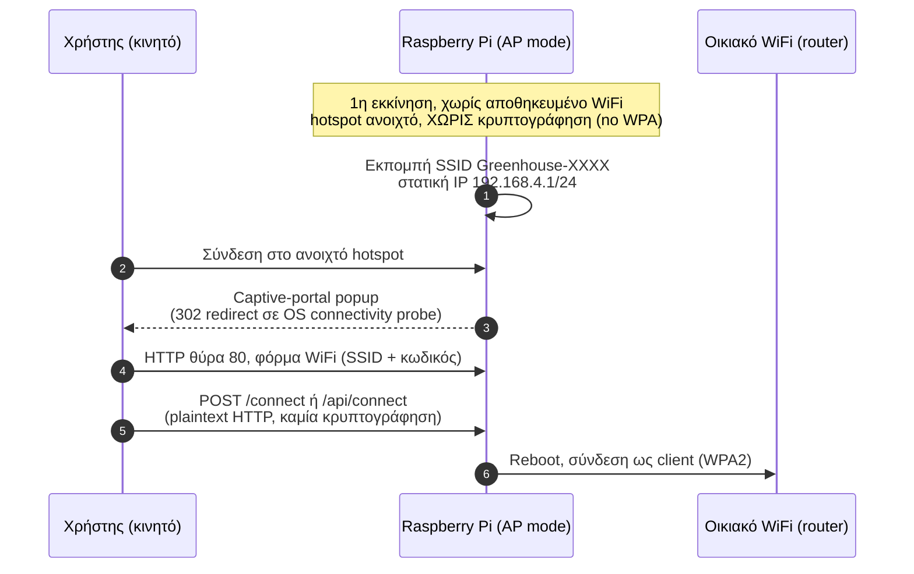
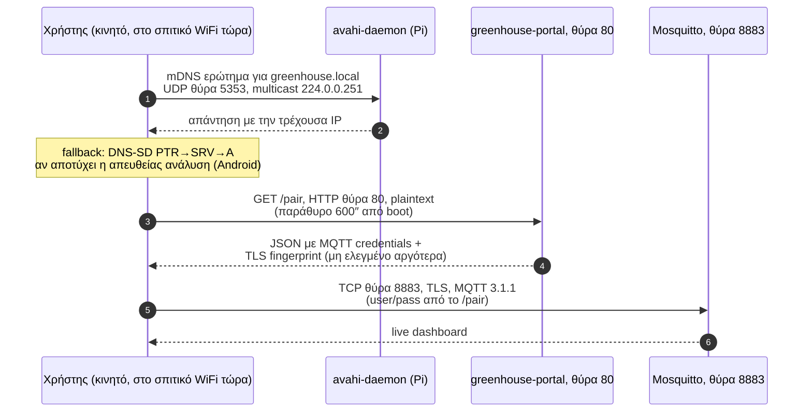

# Αρχιτεκτονική Συστήματος — Διαγράμματα Ροής

**Τελευταία ενημέρωση:** 2026-07-20

Σειρά μικρών, εστιασμένων διαγραμμάτων Mermaid αντί για δύο μεγάλα/πυκνά —
κάθε ένα καλύπτει **ένα** κομμάτι της αρχιτεκτονικής, με έμφαση σε
πρωτόκολλα/θύρες/auth όπου έχει σημασία. Για ακόμα πιο αναλυτική τεχνική
τεκμηρίωση (OSI-layer λεπτομέρεια, γιατί επιλέχθηκε κάθε τεχνολογία), δες
`docs/technical/00-INDEX.md` — αυτό το αρχείο είναι το "χάρτης πτήσης",
εκείνο το "εγχειρίδιο μηχανικού".

**Δομή:**
- §1 — Αρχιτεκτονική & ροή δεδομένων, σε 6 υποδιαγράμματα (1.1–1.6)
- §2 — Πρώτη εγκατάσταση & ζεύξη, σε 2 υποδιαγράμματα (2.1–2.2)

Σημειώσεις ακρίβειας (λάθη που κυκλοφορούν σε παλιότερα σχέδια/έγγραφα):

- Η εφαρμογή συνδέεται με **MQTT TCP TLS στη θύρα 8883** — ΟΧΙ με WebSockets.
  Ο listener WebSocket στη θύρα 9001 **αφαιρέθηκε εντελώς** (2026-07-20) —
  ποτέ δεν τον χρησιμοποίησε κανένα client (δοκιμάστηκε αρχικά, βρέθηκε bug
  του `mqtt_client` 10.x με Mosquitto 2.x, εγκαταλείφθηκε).
- Η γέφυρα (gateway) είναι **ασύρματη** (ESP-NOW → WiFi/MQTT). Η σύνδεση USB
  serial στο Pi ήταν παλιό σχέδιο και δεν υπάρχει σήμερα (υπάρχει πλέον ως
  νέο, εναλλακτικό **design spec** για μελλοντική υλοποίηση — δες
  `docs/superpowers/specs/2026-07-20-uart-bridge-design.md`).
- Οι κόμβοι αισθητήρων μπορούν να μιλούν **είτε απευθείας στη γέφυρα είτε
  μέσω άλλων κόμβων ως relay** (dynamic multi-hop mesh, όχι πια απλά
  single-hop) — δες `docs/MESH_RELAY_EXPLAINED.md`.
- Η απομακρυσμένη πρόσβαση γίνεται μέσω **HiveMQ Cloud** (custom MQTT
  bridge) — όχι Tailscale, όχι port forwarding.
- Το portal τρέχει στη **θύρα 80** και έχει δύο ρόλους: captive portal στην
  εγκατάσταση, και `/pair` + `/api/history` σε κανονική λειτουργία.

---

## 1. Αρχιτεκτονική & ροή δεδομένων

### 1.1 Επίπεδο αισθητήρων — ESP-NOW mesh (χωρίς IP, χωρίς θύρες TCP/UDP)

**Πρωτόκολλο:** ESP-NOW (proprietary της Espressif, πάνω από 802.11 Action
Frames) — **layer 2 only**, καμία διεύθυνση IP, καμία θύρα TCP/UDP, καμία
έννοια "port" εδώ. Ζώνη 2.4GHz αποκλειστικά. Διευθυνσιοδότηση αμιγώς με
6-byte MAC. Τα δεδομένα μέτρησης είναι **κρυπτογραφημένα** (AES-128-CTR, PMK/
LMK κοινό στο δίκτυο)· τα "beacons" (ανακοίνωση rank) είναι αναγκαστικά
plaintext (hardware περιορισμός σε broadcast frames). Πλήρης ανάλυση σε OSI
layers: `docs/technical/02-esp-now-protocol.md`. Ο αλγόριθμος επιλογής
γονέα/relay: `docs/technical/03-mesh-routing.md`.

---

### 1.2 Γέφυρα → Pi — MQTT ingest (πρωτόκολλα & θύρες)

**Στοίβα πρωτοκόλλων, από κάτω προς τα πάνω:**
1. Η γέφυρα συνδέεται σαν κανονικός WiFi client στο σπιτικό router (802.11,
   WPA2) — μοναδικό σημείο όπου η γέφυρα μπαίνει σε "κανονικό" δίκτυο.
2. TCP σύνδεση στη θύρα **8883** του Pi (`greenhouse.local` μέσω mDNS).
3. TLS 1.2 handshake πάνω από αυτό το TCP socket — **αλλά** η γέφυρα κάνει
   `setInsecure()`: κρυπτογραφεί το κανάλι, δεν επικυρώνει όμως το
   πιστοποιητικό του server (βλ. `docs/technical/10-security.md §3`).
4. Μέσα στο κρυπτογραφημένο κανάλι, MQTT 3.1.1 framing — αυθεντικοποίηση με
   username/password (`app` / μοναδικό ανά μονάδα).
5. Δημοσίευση μετρήσεων σε topics `greenhouse/<zone>/air/temperature` κλπ.,
   πάντα με `retain=true` ώστε η εφαρμογή να βλέπει αμέσως την τελευταία
   τιμή σε reconnect. Πλήρης ανάλυση: `docs/technical/04-bridge-gateway.md`.

---

### 1.3 Εσωτερικές υπηρεσίες Pi — τοπική επικοινωνία (loopback :1883)

**Γιατί χωρίς TLS/auth εδώ:** ο listener 1883 δένεται **αποκλειστικά** στο
`127.0.0.1` — αδύνατο να τον φτάσει οτιδήποτε εκτός του ίδιου μηχανήματος,
ανεξάρτητα από firewall (το ίδιο το TCP stack του πυρήνα αρνείται εξωτερική
σύνδεση). Η "ασφάλεια" εδώ είναι δικτυακή απομόνωση, όχι κρυπτογράφηση.
Πλήρες δέντρο topics: `docs/technical/05-mqtt-broker.md §4`.

---

### 1.4 Recorder pipeline & σχήμα SQLite

**Καμία μεμονωμένη μέτρηση δεν γράφεται στον δίσκο.** Οι μετρήσεις
συσσωρεύονται στη RAM ανά λεπτό και γράφονται μαζικά — μία συναλλαγή ανά
λεπτό αντί για μία εγγραφή ανά πακέτο (οι κόμβοι στέλνουν κάθε 5″, άρα ~12×
λιγότερες εγγραφές στην SD). `WAL mode` επιτρέπει ταυτόχρονη ανάγνωση
(portal) ενώ γράφει ο recorder. Γιατί SQLite και όχι MariaDB/InfluxDB:
`docs/technical/06-database.md`. Πλήρης ανάλυση buffering/rollup:
`docs/technical/07-recorder-service.md`.

---

### 1.5 Portal & σύνδεση εφαρμογής (LAN)

**Δύο εντελώς διαφορετικά επίπεδα ασφάλειας στο ίδιο LAN, ταυτόχρονα:** η
MQTT ζεύξη (:8883) έχει τουλάχιστον κρυπτογράφηση καναλιού (αν όχι πλήρη
επικύρωση πιστοποιητικού)· η HTTP ζεύξη (:80) προς το portal είναι **εντελώς
απροστάτευτη** — καθαρό κείμενο, καμία TLS. Αποδεκτό μόνο επειδή είναι
LAN-only. Πλήρης ανάλυση ασφάλειας: `docs/technical/10-security.md`.

---

### 1.6 Απομακρυσμένη πρόσβαση — HiveMQ Cloud bridge

**Γιατί custom bridge αντί για το native bridge του Mosquitto:** το
built-in `connection` directive του Mosquitto **ποτέ δεν έκανε επιτυχές
handshake** με αυτό το HiveMQ cluster (0 CONNACKs σε 9 μέρες logs) —
πραγματική ασυμβατότητα κώδικα, όχι θέμα λογαριασμού. Αντικαταστάθηκε με
μικρό Python script (`hivemq_bridge.py`) που κάνει ακριβώς τη δουλειά με
`paho-mqtt`. Μοναδικό σημείο σε όλο το σύστημα με **πλήρη** TLS επικύρωση
(η γέφυρα και η εφαρμογή και οι δύο δέχονται any-certificate στα δικά τους
σκέλη). Πλήρης ανάλυση: `docs/technical/08-cloud-bridge.md`.

---

### Σημειώσεις σε όλο το §1

- Το οικιακό router παραλείπεται σκόπιμα ως κόμβος σε αυτά τα διαγράμματα —
  είναι απλώς το μεταφορικό μέσο του LAN, δεν προσθέτει πληροφορία στη ροή.
- Τα γραφήματα ιστορικού δουλεύουν και εκτός LAN: η εφαρμογή στέλνει το
  ερώτημα μέσω MQTT (`greenhouse/history/request` →
  `greenhouse/history/response/<id>`, απαντά ο recorder) αντί για HTTP :80,
  το οποίο δεν αναμεταδίδεται μέσω HiveMQ (§1.6 γεφυρώνει μόνο MQTT, ποτέ
  HTTP). Η εφαρμογή διαλέγει αυτόματα HTTP όταν είναι στο LAN, MQTT όταν
  είναι εκτός.
- Πλήρης συγκεντρωτικός πίνακας κάθε θύρας/πρωτοκόλλου/OSI-layer σε όλο το
  σύστημα (και τα δύο §1 και §2 μαζί): `docs/technical/14-network-reference.md`.

---

## 2. Πρώτη εγκατάσταση & ζεύξη (setup mode)

### 2.1 AP mode — αρχική ρύθμιση WiFi

**Θύρες/πρωτόκολλα εδώ:** το hotspot της AP φάσης είναι **ανοιχτό δίκτυο**
(καμία κρυπτογράφηση layer-2, σε αντίθεση με WPA2) — η μόνη προστασία είναι
φυσική εγγύτητα. Η φόρμα WiFi σερβίρεται πάνω από απλό HTTP :80, plaintext.
Πλήρης ανάλυση captive portal/NetworkManager: `docs/technical/09-setup-portal.md`.

---

### 2.2 Εύρεση & ζεύξη (mDNS + `/pair` + πρώτη σύνδεση)

**Θύρες/πρωτόκολλα εδώ:** mDNS πάνω από UDP **5353** (multicast, RFC 6762/
6763) — αποκεντρωμένη ανάλυση ονόματος χωρίς κεντρικό DNS server. Το
`/pair` σερβίρεται πάνω από **plaintext HTTP :80** και επιστρέφει
credentials σε καθαρό κείμενο — η μόνη «αυθεντικοποίηση» σήμερα είναι το
χρονικό παράθυρο 600″. (**Design σε εξέλιξη, μη υλοποιημένο ακόμα:** PIN +
lockout για να κλείσει αυτό το κενό — δες
`docs/superpowers/specs/2026-07-17-direct-pi-pairing-design.md`.) Πλήρης
ανάλυση mDNS/DNS-SD: `docs/technical/09-setup-portal.md §8`.

### Σημειώσεις σε όλο το §2

- Κάθε μονάδα Pi παράγει στην πρώτη εκκίνηση **δικά της** μοναδικά: TLS
  πιστοποιητικά, κωδικό MQTT, κωδικό λειτουργικού, και SSID `Greenhouse-XXXX`
  (από τη MAC) — γι' αυτό το κλωνοποιημένο SD image είναι ασφαλές για μαζική
  παραγωγή.
- Το παράθυρο ζεύξης (`/pair`) μένει ανοιχτό 600 δευτερόλεπτα μετά την
  εκκίνηση του portal· ξανανοίγει με `sudo systemctl restart greenhouse-portal`.
