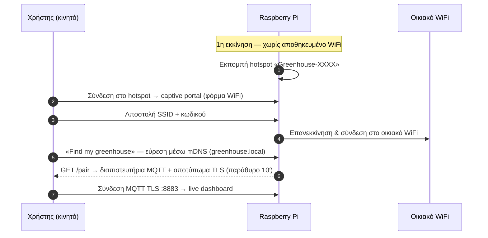

# Αρχιτεκτονική Συστήματος — Διαγράμματα Ροής

**Τελευταία ενημέρωση:** 2026-07-08

Ένα ενιαίο διάγραμμα Mermaid για κατανόηση/παρουσίαση της αρχιτεκτονικής (π.χ. στη
διπλωματική) — δείχνει τη ροή δεδομένων από τους κόμβους αισθητήρων μέχρι την
εφαρμογή, μαζί με την εσωτερική λειτουργία της βάσης δεδομένων ιστορικού. Η ροή
**πρώτης εγκατάστασης & ζεύξης** μένει ξεχωριστά (§2) γιατί είναι sequence
διάγραμμα — διαφορετικός τύπος διαγράμματος, δεν συγχωνεύεται καθαρά σε ένα
flowchart χωρίς να χαθεί η αναγνωσιμότητα.

Σημειώσεις ακρίβειας (λάθη που κυκλοφορούν σε παλιότερα σχέδια/έγγραφα):

- Η εφαρμογή συνδέεται με **MQTT TCP TLS στη θύρα 8883** — ΟΧΙ με WebSockets στην
  9001 (δοκιμασμένο και σπασμένο: bug του `mqtt_client` 10.x με Mosquitto 2.x).
- Η γέφυρα (gateway) είναι **ασύρματη** (ESP-NOW → WiFi/MQTT). Η σύνδεση USB serial
  στο Pi ήταν παλιό σχέδιο και δεν υπάρχει.
- Οι κόμβοι αισθητήρων μιλούν **απευθείας στη γέφυρα** (single-hop ESP-NOW).
  Multi-hop αναμετάδοση κόμβου-σε-κόμβο είναι μελλοντική επέκταση (διακεκομμένη
  γραμμή στο διάγραμμα).
- Η απομακρυσμένη πρόσβαση γίνεται μέσω **HiveMQ Cloud** (MQTT bridge) — όχι
  Tailscale, όχι port forwarding.
- Το portal τρέχει στη **θύρα 80** και έχει δύο ρόλους: captive portal στην
  εγκατάσταση, και `/pair` + `/api/history` σε κανονική λειτουργία.

---

## 1. Αρχιτεκτονική, ροή δεδομένων & βάση ιστορικού

```mermaid
flowchart LR
    classDef hw fill:#e1f5fe,stroke:#0288d1,stroke-width:2px;
    classDef sw fill:#f3e5f5,stroke:#7b1fa2,stroke-width:2px;
    classDef db fill:#fffde7,stroke:#f9a825,stroke-width:2px;
    classDef mem fill:#e0f2f1,stroke:#00796b,stroke-width:2px;
    classDef cloud fill:#fff3e0,stroke:#f57c00,stroke-width:2px;
    classDef client fill:#e8f5e9,stroke:#388e3c,stroke-width:2px;

    subgraph Field ["Θερμοκήπιο — κόμβοι μπαταρίας / ηλιακού"]
        direction TB
        Node1["Κόμβος Ζώνης 1 — ESP32-C3<br/>θερμ./υγρασία αέρα,<br/>υγρασία εδάφους, φωτεινότητα"]:::hw
        NodeN["Κόμβος Ζώνης N — ESP32-C3<br/>(ίδιοι αισθητήρες ανά ζώνη)"]:::hw
    end

    subgraph LAN ["Τοπικό δίκτυο (τροφοδοσία από πρίζα)"]
        direction TB
        Bridge["Γέφυρα ESP32 (Gateway)<br/>δέκτης ESP-NOW ➜ εκδότης MQTT"]:::hw

        subgraph Pi ["Raspberry Pi Zero W — τοπικός διακομιστής"]
            direction TB
            Broker["Mosquitto MQTT Broker<br/>8883 TLS + auth (εξωτερικά)<br/>1883 μόνο loopback (εσωτερικά)"]:::sw
            Weather["greenhouse-weather<br/>πρόγνωση Open-Meteo, κανόνες<br/>αυτοματισμού, ειδοποιήσεις"]:::sw

            subgraph Rec ["greenhouse-recorder"]
                direction TB
                Buffer["Buffer στη RAM<br/>κουβάδες ανά (σειρά, λεπτό):<br/>avg / min / max / πλήθος"]:::mem
                Flush["Μαζική εγγραφή κάθε 60″<br/>(μία συναλλαγή SQLite)"]:::sw
                Rollup["Ωριαία συμπύκνωση + καθαρισμός<br/>(watermark ώστε καμία ώρα<br/>να μη χαθεί)"]:::sw
            end

            subgraph DB ["SQLite — greenhouse.db (WAL mode)"]
                direction TB
                Series[("series<br/>id · kind · zone · metric")]:::db
                Readings[("readings — ανά λεπτό<br/>avg/min/max/n · 90 ημέρες")]:::db
                Hourly[("readings_hourly — ανά ώρα<br/>ίδιες στήλες · 2 έτη")]:::db
            end

            Portal["greenhouse-portal — Flask :80<br/>ζεύξη /pair, ιστορικό /api/history,<br/>captive portal 1ης εγκατάστασης"]:::sw
        end
    end

    subgraph Cloud ["Internet / Cloud"]
        HiveMQ["HiveMQ Cloud<br/>MQTT broker αναμετάδοσης<br/>για πρόσβαση εκτός σπιτιού"]:::cloud
    end

    subgraph Phone ["Εφαρμογή κινητού — Flutter (Android)"]
        AppUI["Dashboard · Έλεγχος · Συσκευές<br/>Καιρός + Κανόνες · Ρυθμίσεις<br/>Ιστορικό: γραφήματα με ζώνη min-max,<br/>επιλογή μετρικής/περιόδου, πρόβλεψη"]:::client
    end

    Node1 -->|"ESP-NOW · low power<br/>(δεν μπαίνουν ποτέ στο WiFi)"| Bridge
    NodeN -->|"ESP-NOW"| Bridge
    NodeN -.->|"μελλοντικά: multi-hop<br/>αναμετάδοση κόμβου-σε-κόμβο"| Node1

    Bridge -->|"MQTT μέσω τοπικού WiFi"| Broker
    Broker -->|"συνδρομή σε topics<br/>αισθητήρων (loopback)"| Buffer
    Weather <-->|"μετρήσεις καιρού, κανόνες,<br/>εντολές actuators (loopback)"| Broker

    Buffer --> Flush --> Readings
    Readings --> Rollup
    Rollup -->|"σταθμισμένος μέσος όρος,<br/>min/max ανά ώρα"| Hourly
    Rollup -->|"διαγραφή εγγραφών<br/>εκτός διατήρησης"| Readings
    Series -.->|"foreign key (ακέραιο id)"| Readings
    Series -.-> Hourly
    Readings --> Portal
    Hourly --> Portal

    Broker <-->|"MQTT TLS :8883<br/>(εντός δικτύου — live δεδομένα)"| AppUI
    Portal -->|"HTTP :80 — ζεύξη &<br/>δεδομένα γραφημάτων (μόνο LAN)"| AppUI
    Broker <-->|"MQTT bridge<br/>(αμφίδρομη αναμετάδοση topics)"| HiveMQ
    HiveMQ <-->|"MQTT TLS<br/>(εκτός σπιτιού)"| AppUI
```

Σημειώσεις:

- Το οικιακό router παραλείπεται σκόπιμα ως κόμβος — είναι απλώς το μεταφορικό
  μέσο του LAN και της σύνδεσης στο Internet, δεν προσθέτει πληροφορία στη ροή.
- **Καμία μεμονωμένη μέτρηση δεν γράφεται στον δίσκο.** Οι μετρήσεις συσσωρεύονται
  στη RAM ανά λεπτό και γράφονται μαζικά — μία συναλλαγή ανά λεπτό αντί για μία
  εγγραφή ανά πακέτο (οι κόμβοι στέλνουν κάθε 5″, άρα ~12× λιγότερες εγγραφές
  στην SD — σημαντικό για τη φθορά της κάρτας).
- Το `series_id` (ακέραιος) αντί για επανάληψη κειμένου `zone`/`metric` σε κάθε
  γραμμή μειώνει το μέγεθος γραμμής και κάνει το ερώτημα εύρους
  `(series_id, ts BETWEEN …)` απλό b-tree scan.
- Αν αποτύχει μια εγγραφή/συμπύκνωση (π.χ. κλειδωμένη βάση), γίνεται rollback και
  η υπηρεσία συνεχίζει — χάνεται το πολύ ~1 λεπτό μετρήσεων, ποτέ η υπηρεσία.
- Τα γραφήματα ιστορικού δουλεύουν **μόνο εντός LAN** (το HTTP :80 δεν
  αναμεταδίδεται μέσω HiveMQ) — γνωστός περιορισμός, καταγεγραμμένος στο backlog.
- Η πρόβλεψη στο γράφημα έχει δύο λειτουργίες: πραγματική πρόγνωση Open-Meteo για
  θερμοκρασία/βροχή (καιρός), γραμμική παρέκταση τάσης για όλα τα υπόλοιπα.

## 2. Πρώτη εγκατάσταση & ζεύξη (setup mode)

Σημειώσεις:

- Κάθε μονάδα Pi παράγει στην πρώτη εκκίνηση **δικά της** μοναδικά: TLS
  πιστοποιητικά, κωδικό MQTT, κωδικό λειτουργικού, και SSID `Greenhouse-XXXX`
  (από τη MAC) — γι' αυτό το κλωνοποιημένο SD image είναι ασφαλές για μαζική
  παραγωγή.
- Το παράθυρο ζεύξης (`/pair`) μένει ανοιχτό 600 δευτερόλεπτα μετά την εκκίνηση
  του portal· ξανανοίγει με `sudo systemctl restart greenhouse-portal`.
