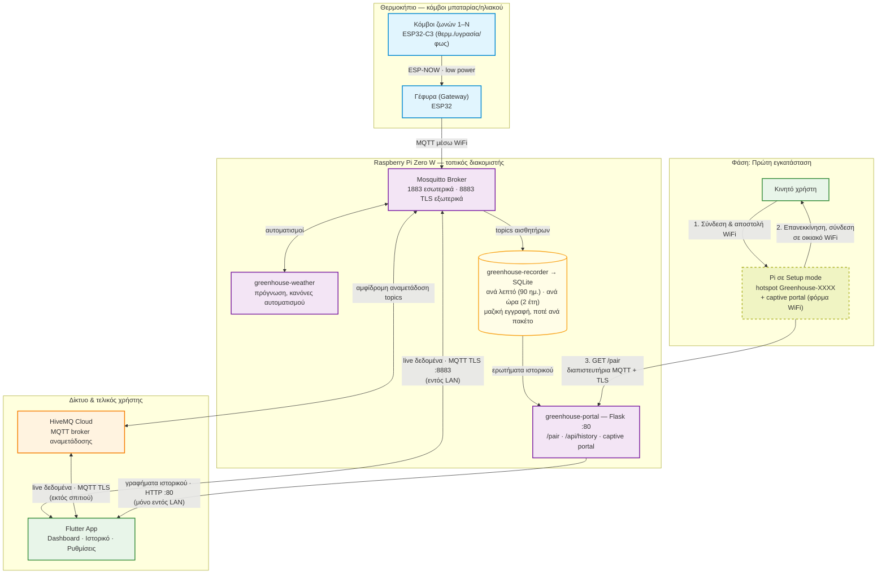

# Αρχιτεκτονική Συστήματος — Διάγραμμα Ροής

**Τελευταία ενημέρωση:** 2026-07-08

Ένα ενιαίο, απλοποιημένο διάγραμμα Mermaid: πρώτη εγκατάσταση, ροή δεδομένων από
τους αισθητήρες μέχρι την εφαρμογή, και η βάση ιστορικού — όλα σε ένα, χωρίς
περιττή λεπτομέρεια, για γρήγορη κατανόηση/παρουσίαση (π.χ. στη διπλωματική).

Σημειώσεις ακρίβειας (λάθη που κυκλοφορούν σε παλιότερα σχέδια/έγγραφα):

- Η εφαρμογή συνδέεται με **MQTT TCP TLS στη θύρα 8883** — ΟΧΙ με WebSockets στην
  9001 (δοκιμασμένο και σπασμένο: bug του `mqtt_client` 10.x με Mosquitto 2.x).
- Η γέφυρα (gateway) είναι **ασύρματη** (ESP-NOW → WiFi/MQTT) — καμία σύνδεση USB
  serial στο Pi.
- Οι κόμβοι αισθητήρων μιλούν **απευθείας στη γέφυρα** (single-hop ESP-NOW).
- Η απομακρυσμένη πρόσβαση γίνεται μέσω **HiveMQ Cloud** — όχι Tailscale.
- Τα γραφήματα ιστορικού δουλεύουν **μόνο εντός LAN** (το HTTP :80 δεν
  αναμεταδίδεται μέσω HiveMQ).
- Κάθε μονάδα Pi παράγει στην πρώτη εκκίνηση **δικά της** μοναδικά: TLS
  πιστοποιητικά, κωδικό MQTT, κωδικό λειτουργικού, SSID `Greenhouse-XXXX` — γι'
  αυτό το κλωνοποιημένο SD image είναι ασφαλές για μαζική παραγωγή.

---

