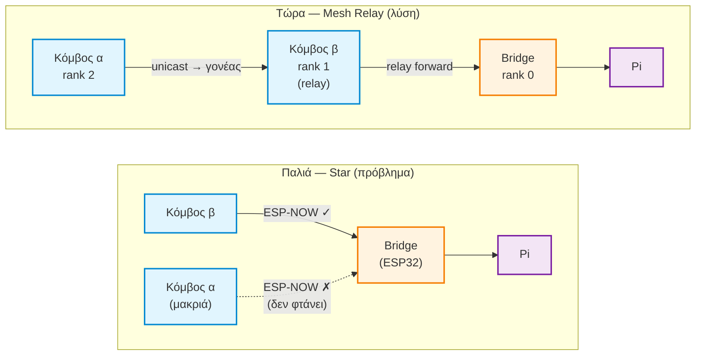
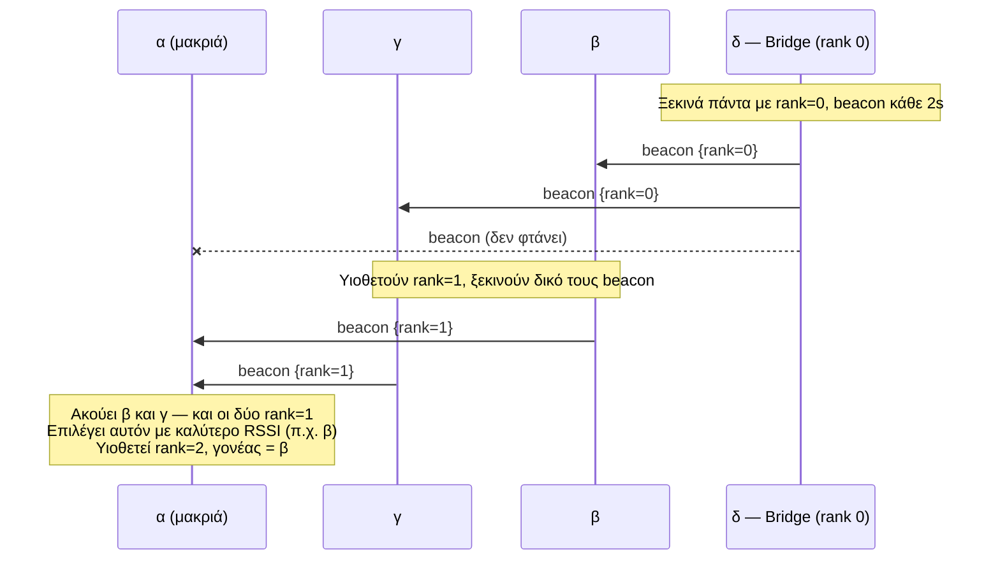
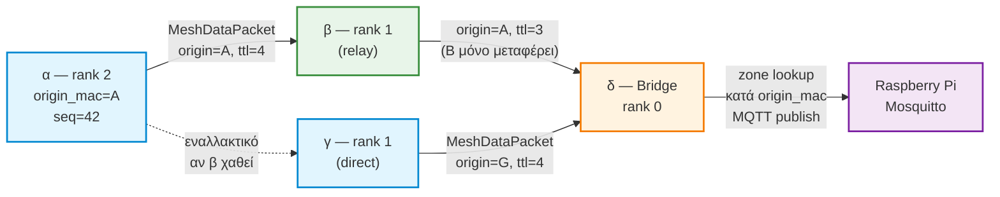
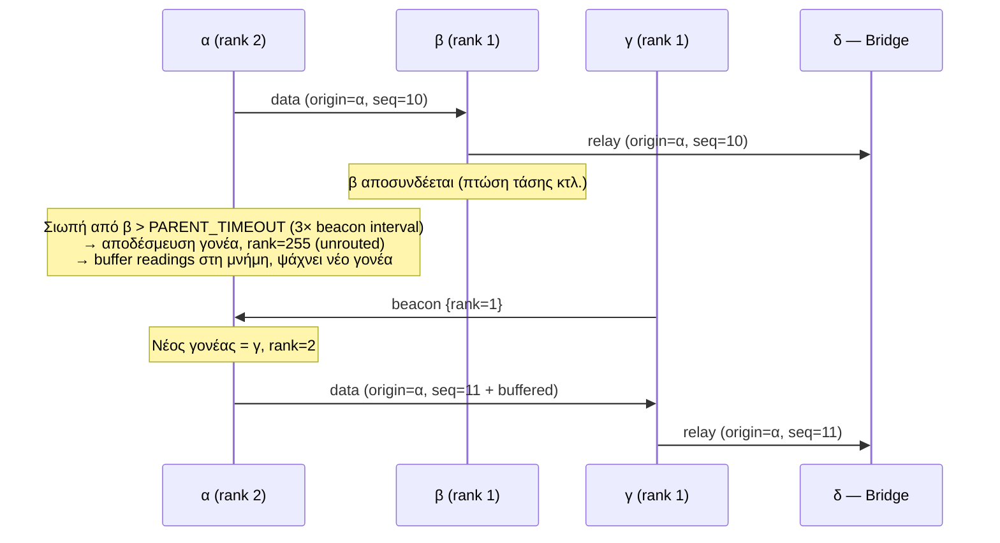

# Dynamic Mesh Relay — Plain-Language Explainer

**Added:** 2026-07-09
**For the full technical version:** design spec
`docs/superpowers/specs/2026-07-09-dynamic-mesh-relay-design.md` and
implementation plan `docs/superpowers/plans/2026-07-09-dynamic-mesh-relay.md`.
This doc is the "explain it like I'm not a networking engineer" version —
useful for the thesis writeup/defense, not a substitute for the spec.

---

## The problem this solves

Before this feature, every sensor had to talk **directly** to the bridge
(the ESP32 plugged into the Pi). If a sensor was too far away — behind a
wall, far corner of the greenhouse — its signal just couldn't reach. It was
stuck, with no fallback.

## The idea: sensors relay for each other

Now every sensor can act like a tiny relay for its neighbors. If sensor C is
too far from the bridge, but sensor B is close enough to *both* C and the
bridge, B just passes C's message along — like a bucket brigade.

```
[Sensor C]  --too far to reach bridge directly-->   ✗

[Sensor C] --> [Sensor B] --> [Bridge] --> Raspberry Pi
   (near)        (relay)      (plugged
                               into the Pi)
```

## How a sensor finds out who to pass its message to

Every device (bridge and sensors) periodically whispers a tiny "here I am,
I'm this many steps from the bridge" announcement (this is the **beacon**,
see the timing section below). The bridge always says "I'm 0 steps away." A
sensor that hears the bridge directly says "I'm 1 step away." A sensor that
only hears sensor B (who is 1 step away) says "I'm 2 steps away" — and
remembers B as its way out.

Each sensor picks whichever neighbor is **closest to the bridge** as its
"forwarding buddy" (the design calls this the node's **parent**), and always
sends its own readings to that buddy. Only devices you've actually
registered (by MAC address) are ever eligible to be a buddy — a stranger's
ESP32 nearby can't sneak in and pretend to be a relay or inject fake data.

## What happens when a sensor takes a reading

1. Sensor C measures temperature/humidity/soil moisture.
2. C sends the reading to its buddy, B (not the bridge — C can't reach it).
3. B sees "this isn't mine, it's a passthrough" and immediately forwards it
   to *its own* buddy — which happens to be the bridge.
4. The bridge receives it and figures out **"this reading actually came from
   C"** (not B — B was just carrying it), then hands it to the Pi over WiFi
   exactly like it always did.
5. The Pi stores it and the app shows it — the app/Pi side of the system
   didn't change at all for this feature.

## Self-healing: what happens if a relay disappears

C notices B stopped whispering its "here I am" announcements. After a few
seconds of silence, C decides B is gone and starts listening for a new
buddy — maybe it can now reach the bridge directly, maybe it finds a
different neighbor. If C genuinely can't reach anyone for a while, it holds
onto its last few readings in memory and keeps retrying, instead of losing
them outright.

## How often the whispering happens, and whether it costs battery

The whisper frequency isn't fixed — it adjusts automatically, like a smoke
detector that beeps more when something's changing and goes quiet once
things settle:

- **Right after something changes** (a sensor boots, loses its buddy, or
  finds a new neighbor): whispers every **2 seconds**.
- **If nothing changes for a while**: the gap doubles each time — 2s → 4s →
  8s → 16s → 32s → capped at **once every 60 seconds**.
- **The moment anything changes again**: snaps straight back to every 2
  seconds until things settle down.

The bridge is the one exception — it always whispers every 2 seconds, no
backoff, since it's plugged into the Pi's power, not a battery.

**Does this affect battery life?** Not today — the sensor firmware doesn't
actually sleep yet (that's separate, not-yet-built future work, see
`EDGE_NODE_POWER_OPTIMIZATION.md`), so the radio is already on all the time
regardless. Once battery-saving sleep does get built, this backoff design is
exactly why it was built this way: each whisper is a very short, cheap radio
burst, and once the network settles it's only firing once a minute per node
— a small, predictable cost that only spikes briefly right after something
actually changes.

## Security in plain terms

- Sensors and the bridge share a network-wide secret key baked into the
  firmware. Actual sensor readings are encrypted with it in transit.
- The "here I am" whispers (beacons) can't be encrypted — that's a hardware
  limitation of the radio protocol (ESP-NOW) being used — but they only ever
  reveal "I exist, I'm this many steps away," never any sensor data.
- Only MAC addresses in the firmware's trusted list are ever eligible to
  become someone's buddy or have their data accepted, regardless of what
  they claim to be.

## Testing multi-hop without real physical distance

Forcing an actual out-of-range sensor is hard to arrange on a desk (ESP-NOW
carries surprisingly far even at low transmit power, so physical separation
or lowering TX power isn't reliably enough at short range). Instead, one
edge sketch has an optional, off-by-default test switch:

```cpp
#define MESH_TEST_IGNORE_BRIDGE   // add above #include <mesh_node.h>, then reflash
```

With this defined, that one board completely ignores the bridge's beacon —
pretends it never heard it — so it's forced to relay through another edge
node instead, regardless of actual signal strength or distance. Remove the
line and reflash to restore normal behavior. It has zero effect on any
board that doesn't explicitly define it.

## Διαγράμματα

### 1. Πριν vs Μετά — Star vs Mesh



---

### 2. Ανακάλυψη ranks μέσω beacons (τετράγωνη διάταξη α β / γ δ)

> ⚠️ **Αντίθετη κατεύθυνση από το διάγραμμα 3.** Εδώ τα beacons ταξιδεύουν
> **από τη γέφυρα προς τα έξω** (ανακοίνωση rank) — το ΑΝΤΙΘΕΤΟ από τα
> πραγματικά δεδομένα αισθητήρων, που ταξιδεύουν **από τους κόμβους προς
> τη γέφυρα** (διάγραμμα 3 παρακάτω). Δύο διαφορετικές φάσεις, δύο
> διαφορετικές κατευθύνσεις — όχι λάθος.



---

### 3. Ροή δεδομένων — 2-hop μονοπάτι



---

### 4. Self-healing — ο relay χάνεται, το δίκτυο επανέρχεται



---

## Files this feature touches

| File | Role |
|---|---|
| `firmware/libraries/GreenhouseMesh/mesh_config.h` | Shared keys, trusted-node list, tuning constants |
| `firmware/libraries/GreenhouseMesh/mesh_node.h` | The actual routing/relay/self-healing logic |
| `firmware/edge_node_esp32_c3/edge_node_esp32_c3.ino` | Sensor node (ESP32-C3 variant) |
| `firmware/edge_node_esp32/edge_node_esp32.ino` | Sensor node (WROOM variant) |
| `firmware/bridge_esp32/bridge_esp32.ino` | The bridge — anchors the network at "0 steps away" |

Nothing under `app/` or `pi/` changed — the Pi's Mosquitto broker, recorder,
and portal don't know or care that a reading took multiple hops to arrive.
