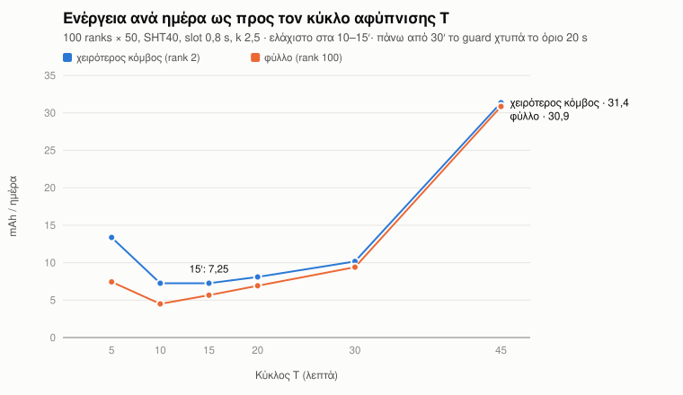
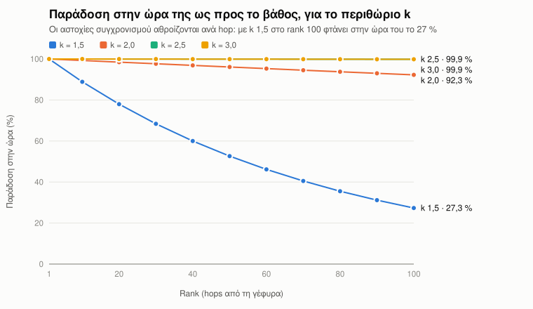
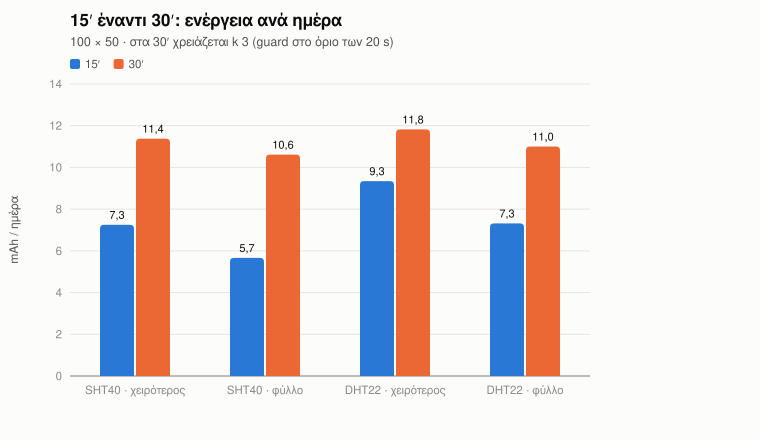
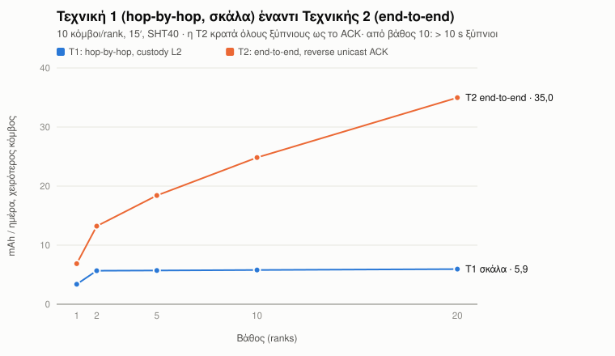
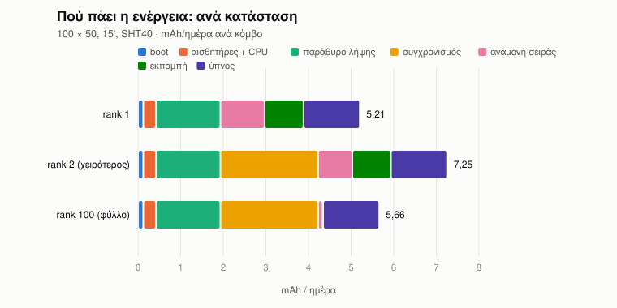
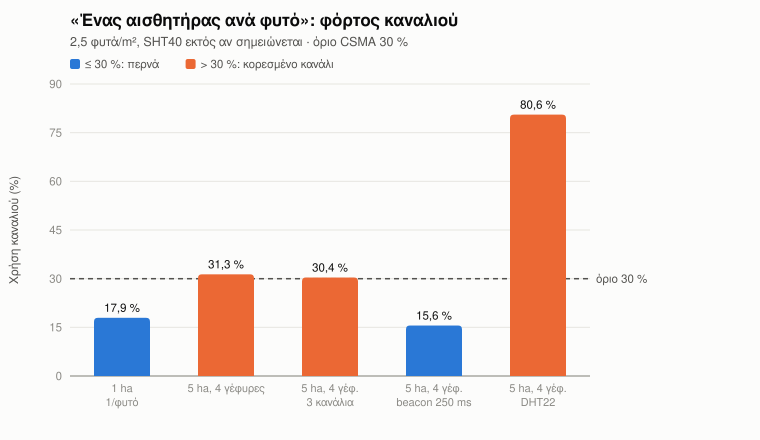

# Κεφάλαιο: Προσομοίωση και βελτιστοποίηση του δικτύου αισθητήρων

*Προσχέδιο κεφαλαίου διπλωματικής. Όλοι οι αριθμοί προέρχονται από τον προσομοιωτή `sim/meshsim` του repo.*
*Τα γραφήματα (`figures/*.svg`) και οι πίνακές τους (`figures/*.csv`) ξαναβγαίνουν με `cd sim && python make_figures.py`.*
*Οι τύποι και οι παραδοχές αναλύονται στο [MODEL.md](MODEL.md) και οι παράμετροι στο [PARAMETERS.md](PARAMETERS.md).*

---

## 1. Σκοπός

Το δίκτυο της εργασίας αποτελείται από κόμβους ESP32-C3 με μπαταρία LiFePO4 και μικρό φωτοβολταϊκό.
Επικοινωνούν με ESP-NOW και στέλνουν τις μετρήσεις τους, μέσω μιας γέφυρας, σε ένα Raspberry Pi.
Η βασική απαίτηση σχεδίασης είναι ότι **κανένας κόμβος δεν είναι μόνιμα αναμμένος**: όλοι κοιμούνται (deep sleep) και όλοι λειτουργούν ως αναμεταδότες.

Στον πάγκο υπάρχουν τρεις κόμβοι. Τα ερωτήματα όμως αφορούν δίκτυα εκατοντάδων ή χιλιάδων κόμβων:
- Πόσο βαθύ μπορεί να γίνει το δίκτυο;
- Πόση ενέργεια ξοδεύει ο πιο φορτωμένος κόμβος;
- Ποιος κύκλος αφύπνισης είναι ο βέλτιστος;
- Πόσο αξιόπιστα φτάνουν οι μετρήσεις;
- Στέκει ένας αισθητήρας σε κάθε φυτό;

Αυτά δεν μπορούν να μετρηθούν σε τρεις πλακέτες, οπότε απαντώνται με προσομοίωση, **δεμένη στις ακριβείς τιμές του firmware και του hardware**.

## 2. Μεθοδολογία

### 2.1 Δύο μηχανές με την ίδια φυσική

- **Calculator (αναλυτικό μοντέλο):**
  - Για κάθε rank κατασκευάζει το χρονοδιάγραμμα ενός κύκλου: πόσο χρόνο περνά ο κόμβος σε κάθε κατάσταση (boot, αισθητήρες, παράθυρο λήψης, συγχρονισμός, αναμονή, εκπομπή, ύπνος) και με ποιο ρεύμα.
  - Από εκεί υπολογίζει ενέργεια, καθυστέρηση, φορτίο buffer και καναλιού.
  - Τα στοχαστικά φαινόμενα (αστοχίες συγχρονισμού, απώλειες, συγκρούσεις) μπαίνουν ως αναμενόμενες τιμές.
- **DES (discrete-event simulation):**
  - Κάθε πλαίσιο, backoff, σύγκρουση, επανάληψη, θέση buffer και αφύπνιση είναι γεγονός στον χρόνο.
  - Το CSMA/CA μοντελοποιείται με carrier sense, hidden terminals και half duplex.
  - Κάθε κόμβος έχει το δικό του μοντέλο ρολογιού ως προς τον γονιό του.
  - Χρησιμοποιείται για να ελέγξει τον calculator.
- **Γεωμετρικό μοντέλο:**
  - Βάζει τους κόμβους σε πραγματικές θέσεις μέσα στο θερμοκήπιο.
  - Υπολογίζει το κανάλι από τη φυσική: two-ray, απώλεια φυλλώματος Weissberger, shadowing, Rician fading.

### 2.2 Δέσιμο με το firmware

Οι παράμετροι **δεν αντιγράφονται με το χέρι**.
- Ένας parser διαβάζει τα `#define`, τα structs, τις μεταβλητές `RTC_DATA_ATTR` και σταθερές κώδικα απευθείας από τα headers και τα sketches του firmware, καθώς και από το script του Pi.
- Κάθε τιμή του καταλόγου (PARAMETERS.md) φέρει την πηγή της: αρχείο:γραμμή, datasheet, πρότυπο, μέτρηση ή υπόθεση.
- Αν αλλάξει το firmware, το test `test_snapshot_matches_live_sources` αποτυγχάνει ώσπου να ενημερωθεί ο κατάλογος.

### 2.3 Επικύρωση

| Έλεγχος | Αποτέλεσμα |
|---|---|
| Χρόνοι στον αέρα ESP-NOW (192 µs + 8·(43+L)) | ακριβώς 600 / 696 / 752 / 1024 / 304 µs |
| Αναπαραγωγή του αρχικού μοντέλου ρολογιών (`cart_sim.py`) | ίδια ακολουθία, ίδιοι αριθμοί |
| Ενέργεια φύλλου Phase 1 @ 15′ | 7,26 mAh/ημ, όπως τα έγγραφα του repo |
| ALOHA και CSMA σε συνθήκες ελέγχου | ταυτίζονται με τους κλειστούς τύπους |
| Επιτυχία με r επαναλήψεις | 1 − p^(r+1) εντός διαστήματος εμπιστοσύνης |
| DES έναντι calculator, 5 000 κόμβοι (100 × 50) | ενέργεια 6,8–7,0 έναντι 7,25 mAh/ημ· PDR 99,3–100 % έναντι 99,93 % |
| Host tests του firmware (CRC, framing, scheduler) | ίδια byte vectors σε C και Python |

Συνολικά 60 tests στον προσομοιωτή, 5 host tests στο firmware και 375 στο Pi.

## 3. Αποτελέσματα

Ρύθμιση αναφοράς, εκτός αν αναφέρεται κάτι άλλο:
- δίκτυο 100 ranks × 50 κόμβους (5 000)·
- κύκλος 15′, αισθητήρας SHT40, παράθυρο λήψης 0,8 s·
- περιθώριο συγχρονισμού k = 2,5·
- γέφυρα με binary πλαισίωση στα 921 600 baud.

### 3.1 Ο κύκλος αφύπνισης T



*Σχήμα 1. Κατανάλωση του χειρότερου κόμβου και του φύλλου ως προς τον κύκλο αφύπνισης.*

Η καμπύλη έχει σχήμα U με **ελάχιστο στα 10–15 λεπτά (7,25 mAh/ημέρα)**.

- **Μικρότερος κύκλος:** οι αφυπνίσεις πολλαπλασιάζονται, και το σταθερό τους κόστος κυριαρχεί (boot, αισθητήρες, παράθυρο).
- **Μεγαλύτερος κύκλος:** μεγαλώνει η αβεβαιότητα του ρολογιού.
  - Η θερμοκρασιακή περιπλάνηση του RC ταλαντωτή μοντελοποιείται ως AR(1) με βήμα ανάλογο του T, οπότε η τυπική απόκλιση αυξάνει με T².
  - Το περιθώριο αφύπνισης μεγαλώνει από 3,7 s (15′) σε 14 s (30′), και κάθε ξύπνημα ακούει περισσότερο.
- **Πάνω από 30′:** το απαιτούμενο περιθώριο ξεπερνά το όριο των 20 s του firmware (`MESH_GUARD_CAP_MS`).
  Οι κόμβοι αρχίζουν να χάνουν τον γονιό τους και η ενέργεια εκτινάσσεται (31 mAh/ημ στα 45′).

**Συμπέρασμα:** το 15′ δεν είναι μόνο πιο συχνή μέτρηση. Είναι και **φθηνότερο ανά ημέρα** από το 30′.
Επιφύλαξη: η κλιμάκωση της περιπλάνησης με το T είναι προέκταση. Επιβεβαιώνεται με μέτρηση του ρολογιού σε T = 1800 s.

### 3.2 Περιθώριο συγχρονισμού και βάθος



*Σχήμα 2. Ποσοστό μετρήσεων που φτάνουν στον ίδιο κύκλο, ανά rank, για διάφορα περιθώρια k.*

Κάθε κόμβος συγχρονίζεται μόνο με τον γονιό του. Αν ανά hop χάνει το ραντεβού με πιθανότητα q, από βάθος r φτάνει στην ώρα του μόνο το (1−q)^(r−1).
- Με το αρχικό k = 1,5 το q είναι 1,3 %, οπότε στο rank 100 φτάνει στην ώρα του μόνο το **27 %** (μέσος όρος 56 %).
- Με **k = 2,5** το ποσοστό μένει πάνω από **99,8 %** σε όλα τα βάθη, με κόστος +0,1 mAh/ημ.
- Το k = 3 δεν προσθέτει τίποτα στα 15′, αλλά χρειάζεται στα 30′.

Ο DES έδειξε ένα φαινόμενο που ο αναλυτικός τύπος υποτιμά. Μία αστοχία σε relay καθυστερεί **ολόκληρο το υποδέντρο** του κατά έναν κύκλο.
Οι μετρήσεις δεν χάνονται: μένουν στον buffer, και ο γονιός δηλώνει BUF_FULL. Αδειάζουν στους επόμενους κύκλους χάρη στο 20 % ελεύθερου χώρου του παραθύρου.

### 3.3 15 έναντι 30 λεπτών



*Σχήμα 3. Ενέργεια ανά ημέρα στα 15′ και στα 30′ (στα 30′ με k = 3), για SHT40 και DHT22.*

| | 15′ | 30′ |
|---|---|---|
| SHT40, χειρότερος κόμβος | **7,25** | 11,38 |
| SHT40, φύλλο | **5,66** | 10,62 |
| DHT22, χειρότερος | **9,35** | 11,82 |
| DHT22, φύλλο | **7,32** | 11,00 |

Και στις τέσσερις περιπτώσεις το 15′ καταναλώνει λιγότερο, ενώ στέλνει διπλάσιες μετρήσεις.

### 3.4 Τεχνική 1 (hop-by-hop) έναντι Τεχνικής 2 (end-to-end)



*Σχήμα 4. Κατανάλωση του χειρότερου κόμβου ως προς το βάθος, 10 κόμβοι ανά rank.*

- **Τεχνική 1** (σκάλα, «hop–απάντηση–hop–απάντηση»):
  - Κάθε κόμβος παραδίδει στον γονιό του με το L2 ACK του ESP-NOW και ξανακοιμάται.
  - Η ενέργεια σχεδόν δεν εξαρτάται από το βάθος (5,7 → 5,9 mAh/ημ από 2 σε 20 ranks).
- **Τεχνική 2** («hop–hop–hop–απάντηση–απάντηση–απάντηση»):
  - Όλοι πρέπει να μένουν ξύπνιοι σε ένα κοινό παράθυρο ώσπου να επιστρέψει η επιβεβαίωση από το Pi.
  - Το παράθυρο μεγαλώνει με το βάθος, ανεβάζοντας την κατανάλωση από 6,9 σε 35 mAh/ημ.
  - Από βάθος 10 ξεπερνά το όριο των 10 s αφύπνισης.
- Η Τεχνική 1 επιλέχθηκε και υλοποιήθηκε στο firmware (CART depth N).

### 3.5 Πού πάει η ενέργεια



*Σχήμα 5. Κατανομή της ημερήσιας κατανάλωσης ανά κατάσταση, για rank 1, rank 2 και φύλλο.*

Ο χειρότερος κόμβος είναι ο **rank 2**, όχι ο rank 1. Κουβαλά 98 ξένες μετρήσεις και επιπλέον πρέπει να συγχρονιστεί με γονιό που κοιμάται.
Ο rank 1 έχει γονιό τη γέφυρα, που είναι πάντα ξύπνια. Η κατανάλωση του rank 2 (7,25 mAh/ημ) χωρίζεται ως εξής:

| Κατάσταση | Μερίδιο |
|---|---|
| Συγχρονισμός (ακρόαση για το beacon του γονιού) | 32 % |
| Παράθυρο λήψης | 21 % |
| Ύπνος | 18 % |
| Εκπομπή | 12 % |
| Αναμονή σειράς | 11 % |
| Αισθητήρες και boot | 6 % |

Άρα οι μεγαλύτερες μελλοντικές βελτιώσεις είναι στο ρολόι:
- εξωτερικός κρύσταλλος 32 kHz, που μειώνει δραστικά το περιθώριο·
- μέτρηση της πραγματικής περιπλάνησης, ώστε το περιθώριο να μην είναι συντηρητικό.

### 3.6 Κλιμάκωση: 5 000 κόμβοι σε βάθος 100

Η βέλτιστη ρύθμιση για 100 ranks × 50 ([WORLD_GREENHOUSE_100x50.md](WORLD_GREENHOUSE_100x50.md)):
- 15′, SHT40, παράθυρο 0,8 s, k = 2,5·
- γέφυρα binary με Pi στα 5 ms ανά μήνυμα.

Αποτελέσματα:
- Ο χειρότερος κόμβος καίει 7,25 mAh/ημ: **138 ημέρες χωρίς ήλιο** και 50× περιθώριο από το φωτοβολταϊκό τον χειμώνα.
- Ο DES με 5 000 κόμβους επιβεβαίωσε 99,3–100 % παράδοση και μηδενικές απώλειες.

Το firmware χρειάστηκε τις εξής αλλαγές, και έχουν πλέον εφαρμοστεί:
- `MESH_MAX_TTL` 64 → 128 (αλλιώς τίποτα πέρα από το rank 65 δεν φτάνει)·
- relay buffer 50 → 110 (ο rank 1 κουβαλά 99 μηνύματα· η RTC μνήμη χωρά ως 121)·
- k = 5/2·
- μεγαλύτεροι πίνακες dedup (128) και γειτόνων (32)·
- binary πλαισίωση γέφυρας–Pi στα 921 600 baud: 0,73 ms ανά μήνυμα αντί για 13 ms.

### 3.7 Ένας αισθητήρας ανά φυτό



*Σχήμα 6. Μέγιστη χρήση καναλιού για «έναν αισθητήρα ανά φυτό» (2,5 φυτά/m²).*

Το γεωμετρικό μοντέλο ([GEOMETRY_PER_PLANT.md](GEOMETRY_PER_PLANT.md)) δίνει hop 52 m μέσα σε φύλλωμα και 79 m προς γέφυρα στα 2 m ύψος.
Έτσι ένα θερμοκήπιο 1 ha έχει βάθος μόνο 2 hops, και οι 100 ranks αντιστοιχούν σε ~5 km μήκος.

Σε πυκνότητα «ανά φυτό» ένας κόμβος ακούει δεκάδες χιλιάδες γείτονες. **Το όριο είναι το κανάλι, όχι οι μπαταρίες.**
Σχεδόν όλο το φορτίο είναι τα RX_OPEN beacons που εκπέμπει κάθε κόμβος όσο είναι ανοιχτό το παράθυρό του.
- Με DHT22 (παράθυρο 2,3 s) το κανάλι φτάνει στο 81 %.
- Με SHT40 και 4 γέφυρες φτάνει στο 31 %, ακριβώς πάνω από το όριο.
- Με **beacon κάθε 250 ms** αντί για 100 ms πέφτει στο 15,6 %.

Η γεωμετρία φανερώνει και ένα φαινόμενο «χωνιού»: με μία γέφυρα σε θερμοκήπιο 1 km, όλη η κίνηση περνά από λίγους κόμβους κοντά στη γέφυρα.
Η λύση είναι γέφυρες στον κεντρικό άξονα, περίπου ανά 250 m. Η επιλογή γονιού με βάση το φορτίο αντί για το RSSI μειώνει επιπλέον το μέγιστο φορτίο 3×.

## 4. Περιορισμοί

- **Μη μετρημένες τιμές:**
  - η περιπλάνηση του ρολογιού σε μεγάλο T·
  - ο χρόνος επεξεργασίας του Pi ανά μήνυμα·
  - το ρεύμα ύπνου της πλακέτας (55 µA, εκτίμηση)·
  - το όριο επαναλήψεων του MAC (δεν τεκμηριώνεται από την Espressif)·
  - το κέρδος κεραίας.
- **Ο DES** χρησιμοποιεί ισορροπημένο layered δέντρο. Το γεωμετρικό μοντέλο είναι αναλυτικό, όχι event-driven.
- **Η χρήση καναλιού** είναι μέσος όρος στον κύκλο, με την υπόθεση ότι οι φάσεις των κόμβων rank 1 είναι απλωμένες.
- **Το firmware CART depth N** έχει ελεγχθεί με host tests και compile, όχι ακόμα σε hardware.

## 5. Συμπεράσματα

1. Ένα δίκτυο όπου **όλοι οι κόμβοι κοιμούνται και όλοι αναμεταδίδουν** είναι εφικτό έως 100 hops και 5 000 κόμβους.
   Κοστίζει ~7 mAh/ημέρα στον χειρότερο κόμβο, κάτι που ένα φωτοβολταϊκό 2 W καλύπτει με μεγάλο περιθώριο.
2. Ο **κύκλος 15′** είναι βέλτιστος και ως προς την ενέργεια.
3. Το **περιθώριο συγχρονισμού** πρέπει να κλιμακώνεται με το βάθος (k = 2,5 για 100 hops).
4. Η **Τεχνική 1** (hop-by-hop με custody) κλιμακώνεται. Η end-to-end όχι.
5. Για πολύ πυκνή εγκατάσταση, το στενό σημείο είναι **το κανάλι**. Λύνεται με γρήγορο αισθητήρα (SHT40), αραιότερα beacons και περισσότερες γέφυρες.

---

### Αναπαραγωγή

```
cd sim
python -m pytest tests            # 60 tests
python run_world_greenhouse.py    # βελτιστοποίηση 100 × 50
python run_world_des.py           # DES 5 000 κόμβων
python run_world_geometry.py      # γεωμετρία / ανά φυτό
python make_figures.py            # τα σχήματα του κεφαλαίου
```
